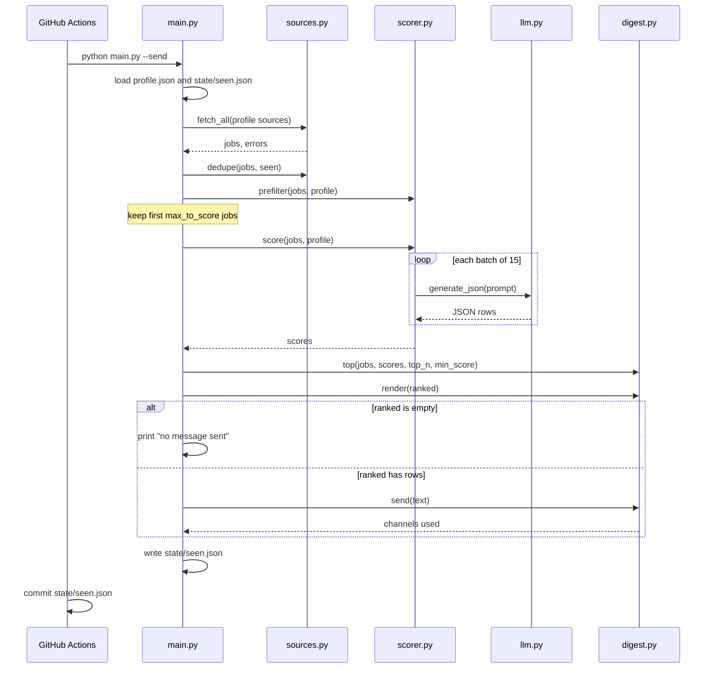

# Daily run sequence

What `python main.py --send` does, in order.

```mermaid
sequenceDiagram
    participant A as GitHub Actions
    participant M as main.py
    participant S as sources.py
    participant C as scorer.py
    participant L as llm.py
    participant D as digest.py
    A->>M: python main.py --send
    M->>M: load profile.json and state/seen.json
    M->>S: fetch_all(profile sources)
    S-->>M: jobs, errors
    M->>S: dedupe(jobs, seen)
    M->>C: prefilter(jobs, profile)
    Note over M: keep first max_to_score jobs
    M->>C: score(jobs, profile)
    loop each batch of 15
        C->>L: generate_json(prompt)
        L-->>C: JSON rows
    end
    C-->>M: scores
    M->>D: top(jobs, scores, top_n, min_score)
    M->>D: render(ranked)
    alt ranked is empty
        M->>M: print "no message sent"
    else ranked has rows
        M->>D: send(text)
        D-->>M: channels used
    end
    M->>M: write state/seen.json
    A->>A: commit state/seen.json
```

Sources: [main.py](../../main.py), [scorer.py](../../scorer.py), [daily.yml](../../.github/workflows/daily.yml)
