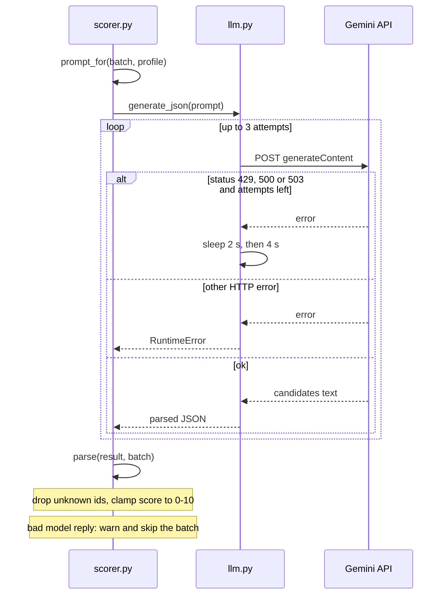

# Scoring and retry sequence

How one batch of postings is scored and how failures are handled.

```mermaid
sequenceDiagram
    participant C as scorer.py
    participant L as llm.py
    participant G as Gemini API
    C->>C: prompt_for(batch, profile)
    C->>L: generate_json(prompt)
    loop up to 3 attempts
        L->>G: POST generateContent
        alt status 429, 500 or 503 and attempts left
            G-->>L: error
            L->>L: sleep 2 s, then 4 s
        else other HTTP error
            G-->>L: error
            L-->>C: RuntimeError
        else ok
            G-->>L: candidates text
            L-->>C: parsed JSON
        end
    end
    C->>C: parse(result, batch)
    Note over C: drop unknown ids, clamp score to 0-10
    Note over C: bad model reply: warn and skip the batch
```

Sources: [scorer.py](../../scorer.py), [llm.py](../../llm.py)
